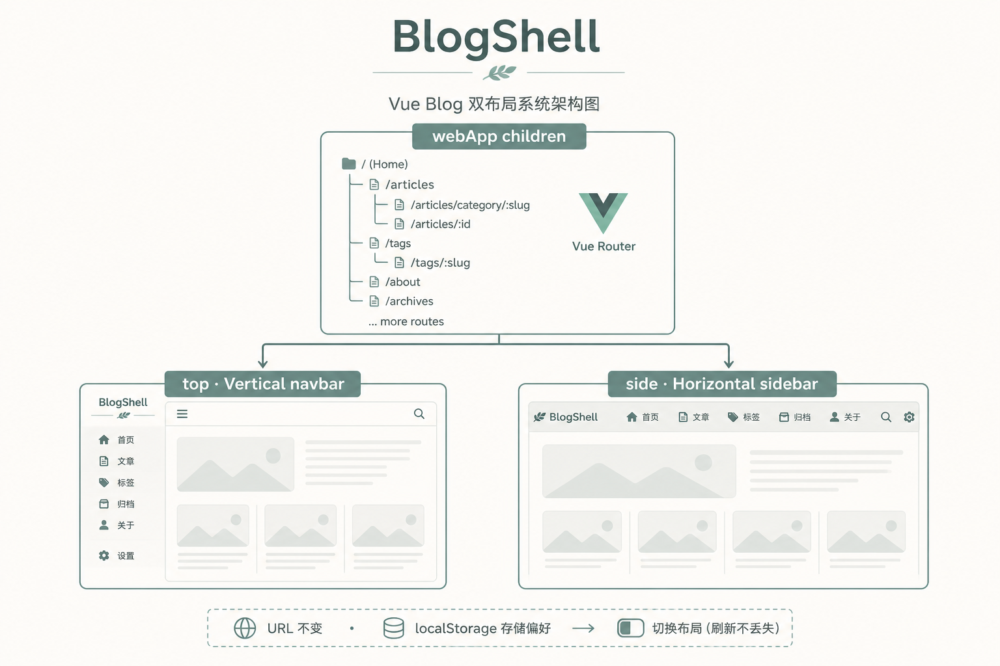

# 一套路由，两副皮囊：用 BlogShell 做博客双布局自由切换

> 系列第 1 篇
> 关键词：BlogShell、blogLayout、top/side、localStorage  
> 源码：`src/layout/blog/BlogShell.vue`、`blogLayoutMixin.js`、`vertical/`、`horizontal/`、`settings.js`

---

## 开头先讲个真实场景

有人喜欢「传统博客」：顶上一排菜单，内容拉满屏宽。  
有人喜欢「文档站手感」：左边目录，右边正文，窄屏再收成抽屉。

早期我们图省事，把首页挂在 Vertical，其它页挂在 Horizontal——**等于用路由拆了两套站**。  
结果是：想「关于页也用顶栏」得改路由；想「全站侧栏」得搬家；动态栏目只挂一边，另一边天然残疾。

后来做成 **BlogShell**：路由只认一套 children，外壳按用户偏好换。地址栏不搬家，刷新还记得你选的布局。



---

## 一、为什么「复制两套 children」是坑

| 做法 | 短期 | 长期 |
|------|------|------|
| webApp / sideApp 各挂一半页面 | 看起来快 | 动态菜单注册两次，易漏 |
| URL 前缀 `/v` `/s` | 切换简单 | 分享链接绑死模板 |
| **单父路由 + 动态外壳** | 要改一次路由表 | 一劳永逸 |

我们选了第三种。命名上有个小坑提醒你：

- `blogLayout === 'top'` → 组件叫 **VerticalBlog**（顶栏横排）  
- `blogLayout === 'side'` → 组件叫 **HorizontalBlog**（侧栏）

名字是历史遗留，读代码时别被 Vertical/Horizontal 绕晕，看 `blogLayout` 字符串更准。

---

## 二、实现步骤（从路由到按钮）

### 步骤 1：合并子路由

把原来散落在两个父级下的页面，收进一个数组，例如 `blogChildrenRoutes`：首页、搜索、文章、关于、文件中转、分类、标签……

### 步骤 2：父级只挂 BlogShell

```js
{
  path: '/',
  name: 'webApp',
  component: BlogShell,
  children: blogChildrenRoutes
}
```

动态栏目继续 `addRoute('webApp', item)`（详见第 0 篇）。

### 步骤 3：写外壳

```vue
<!-- BlogShell.vue -->
<template>
  <component :is="layoutComp" />
</template>

<script>
import VerticalBlog from '@/layout/blog/vertical/index'
import HorizontalBlog from '@/layout/blog/horizontal/index'

export default {
  name: 'BlogShell',
  components: { VerticalBlog, HorizontalBlog },
  computed: {
    blogLayout() {
      return (this.$store.state.settings && this.$store.state.settings.blogLayout) || 'top'
    },
    layoutComp() {
      return this.blogLayout === 'side' ? 'HorizontalBlog' : 'VerticalBlog'
    }
  }
}
</script>
```

外壳本身**没有** `<router-view>`。真正的 `router-view` 在 Vertical / Horizontal 内部——和「父组件直接是某个 Layout」时一样，嵌套出口在子树里就能匹配到。

### 步骤 4：偏好进 Vuex + localStorage

```js
// settings.js 默认
blogLayout: 'top'

// store/modules/settings.js
blogLayout: localStorage.getItem('blogLayout') || blogLayout || 'top'

// CHANGE_SETTING 里已有 localStorage.setItem(key, value)
```

### 步骤 5：两边 Layout 共用 mixin

```js
// blogLayoutMixin.js
methods: {
  toggleBlogLayout() {
    const next = this.blogLayout === 'side' ? 'top' : 'side'
    this.$store.dispatch('settings/changeSetting', {
      key: 'blogLayout',
      value: next
    })
  }
}
```

- 顶栏布局：放在右下角设置浮层里  
- 侧栏布局：放在顶栏搜索旁一颗按钮  

点一下，`BlogShell` 的 `layoutComp` 变了，整壳 remount，页面组件若包了 `keep-alive` 还能少丢一点状态。

---

## 三、侧栏布局里值得单独说的体验

Horizontal 不只是「左边一列链接」：

1. **桌面可折叠到仅图标**（localStorage `gp-side-collapsed`）  
2. **收起后有子菜单**：不要展开整栏，用 **aside 外的 fixed 浮层** 弹出子项（hover / 点击都行）  
3. **移动端抽屉** + mask，打开时锁 body 滚动  

浮层必须挂在 `transform` 的 aside **外面**，否则 `position: fixed` 会被祖先 transform 锁死——和导航下拉被 `backdrop-filter` 裁切是同一类课（第 6 篇还会讲）。

---

## 四、过程里踩过的坑

### 坑 1：切换布局等于切换路由？

早期心理模型是「换父路由」。正确模型是「**换渲染壳**」。  
URL、动态栏目、权限守卫都不用为切换布局再写一套。

### 坑 2：默认值争议

默认 `top` 还是 `side`？我们默认 `top`，更接近传统博客首页；你重度用侧栏可以把 `settings.js` 改成 `side`，或让用户自己切一次后写入 localStorage。

### 坑 3：keep-alive 的 key

两边都用了类似 `:key="keyMenuPath"`。布局切换会丢外壳内状态，这是预期；文章列表滚动位置若要跨布局保留，需要提升状态到 Vuex，一般不必。

---

## 五、验收清单

- [ ] `/` 与 `/about` 能用同一偏好切换外壳  
- [ ] 刷新后布局偏好还在  
- [ ] 动态栏目在两种布局下都能点进  
- [ ] 侧栏收起后子菜单浮层可点，不撑开整栏  
- [ ] 移动端抽屉可开关，不穿透滚动  

---

## 六、小结

BlogShell 的价值是一句话：

> **让布局变成设置项，而不是路由分叉。**

配上第 0 篇的双重动态路由，博客站既有「可运营的栏目」，又有「可切换的阅读壳」。

---


---

## 七、把「切换」做成用户能感知的产品，而不只是开发开关

很多技术文写完 Shell 就停了。产品侧还差半步：用户怎么知道可以切换？

我们实践里的摆放：

1. **侧栏布局顶栏**：搜索框旁边一颗图标按钮，title 写清「切换为顶部导航」  
2. **顶栏布局**：右下角设置浮层里，和深色模式、点击飘字放一起——偏「高级设置」  
3. **文案不要写 Vertical/Horizontal**，写用户能懂的「顶部导航 / 侧栏导航」

切换瞬间整壳 remount，会有一次轻微闪动。可以接受；若你强迫症，可以给外壳加很短的 fade（注意别和路由过渡叠成两次动画）。

### 和动态栏目的关系再强调一次

栏目 `addRoute` 挂在 `webApp` 上，**不挂在某一个 Layout 组件名上**。  
所以无论当前是 top 还是 side，栏目 path 都成立。这是 BlogShell 成立的前提，也是第 0 篇要先读的原因。

### 侧栏收起 + 子菜单浮层：完整一点的行为说明

```text
桌面收起（isDesktopCollapsed）
  ├─ 悬停有 children 的项 → openFlyout(index)
  ├─ 点击同一项 → 切换浮层开关（不再展开整栏）
  ├─ 鼠标移入浮层 → keepFlyout（清掉 leave 定时器）
  ├─ 移出 → 160ms 后关闭（给跨 gap 的时间）
  └─ 路由变化 / 展开侧栏 → closeFlyout
```

浮层用 `getBoundingClientRect` 算 `top/left`，挂在 layout 根上而不是 aside 里。  
滚动侧栏 nav 时要 `updateFlyoutPos`，否则浮层会「悬空」在旧坐标。

### 本地调试小技巧

```js
// 控制台强制切布局
$store.dispatch('settings/changeSetting', { key: 'blogLayout', value: 'side' })
localStorage.getItem('blogLayout')
```

清掉偏好：`localStorage.removeItem('blogLayout')` 后刷新，回到 `settings.js` 默认值。

### 什么时候不该用 BlogShell

- 两套布局的**页面结构完全不同**（例如一侧是 SSR 营销页，一侧是 SPA 应用）——那是两套产品，不是换皮  
- 你需要 SEO 上「不同布局不同 URL」——那反而该用路径前缀方案  

博客阅读壳互换，BlogShell 很合适。


**系列导航**  
[← 上一篇：双重动态路由与守卫](./00-双重动态路由与守卫.md) ｜ [下一篇：菜单溢出折叠 →](./02-横屏菜单溢出折叠到更多.md)
