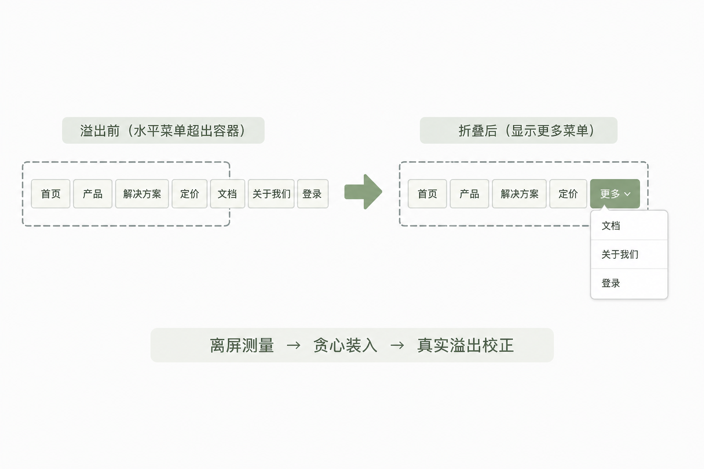

# 顶栏菜单装不下怎么办：离屏测量 + 折进「更多」（含一次全站误折叠事故）

> 系列第 2 篇（第二版）
> 关键词：overflow、visibleCount、outerWidth、scrollWidth、更多  
> 源码：`src/components/BlogNavMenu/index.vue`、`src/layout/components/Topbar/index.vue`、`Navbar.vue`

---

## 为啥要单独写一篇

菜单一多，顶栏只有三种死法：

1. **换行**——高度从 60 变成 120，整站跳动  
2. **横向滚动**——像 2005 年的后台  
3. **挤飞右侧**——搜索、头像、主题按钮被挤出视口  

我们要的第四种：**单行，多出来的进「更多」**。  
前台博客顶栏和后台管理顶栏各做了一套，算法同构。



---

## 一、实现思路（先建立直觉）

想象你在往一个固定宽度的盒子里摆积木：

1. 先在桌子外面（离屏）把每块积木的真实宽度量好——**不能在已经挤扁的盒子里量**  
2. 从左（或从右，看对齐）一块块放，放不下就预留「更多」积木的宽度  
3. 真放进盒子后，再瞄一眼有没有仍溢出（字体晚加载会变宽）  
4. 只有「真溢出」才继续拿掉一块；**千万别拿盒子的外宽去跟人为缩小的预算比**

第四步我们踩过坑，后面单独讲。

---

## 二、前台 BlogNavMenu：步骤拆解

### 步骤 1：双列表

- **可见列表** `ref="list"`：只渲染 `primaryItems` + 可选「更多」  
- **测量列表** `ref="measure"`：渲染全部 `allItems` + 「更多」样板，丢到屏幕外

```html
<ul ref="measure" class="gp-nav-menu__measure" aria-hidden="true">
  <li v-for="item in allItems" ...>...</li>
  <li><!-- 更多 --></li>
</ul>
```

### 步骤 2：outerWidth 含 margin

```js
outerWidth(el) {
  const rect = el.getBoundingClientRect()
  const style = window.getComputedStyle(el)
  return Math.ceil(
    rect.width +
    (parseFloat(style.marginLeft) || 0) +
    (parseFloat(style.marginRight) || 0)
  )
}
```

只量 `width` 时，最后一项经常「差那么 4px」挂在外面。

### 步骤 3：贪心装入

```js
const budget = Math.max(0, avail - 4) // 小安全边距
const sumAll = widths.reduce((a, b) => a + b, 0)
if (sumAll <= budget) {
  this.visibleCount = widths.length
} else {
  let used = 0, count = 0
  for (let i = 0; i < widths.length; i++) {
    if (used + widths[i] + this.moreWidth <= budget) {
      used += widths[i]
      count++
    } else break
  }
  this.visibleCount = count
}
```

### 步骤 4：容器必须「可被挤压」

```scss
.gp-blog-nav.is-desktop {
  flex: 1 1 0;
  min-width: 0;
  width: 0; // 经典技巧：按剩余空间分，而不是按内容最小宽
  max-width: 100%;
}
```

父级若 `flex-shrink: 0`，你算得再准也没意义——盒子会跟着内容一起变宽。

### 步骤 5：何时重算

- `ResizeObserver` 盯宿主  
- `window.resize`  
- `document.fonts.ready`（中文字体换宽很常见）  
- `menus` / `allItems` 变化  
- 双 `requestAnimationFrame` 等一帧布局稳定  

---

## 三、事故复盘：为什么「明明没超出，全进更多了」

二次收紧曾写成：

```js
// ❌
overflowed = list.scrollWidth > budget
// budget = avail - SAFETY
```

列表 CSS 是 `width: 100%`。内容没超时：

- `scrollWidth ≈ clientWidth ≈ avail`（比如 800）  
- `budget = 796`  
- `800 > 796` 恒成立 → `visibleCount--` 直到 0  

**修复：**

```js
// ✅ 只认真实横向溢出
const overflowed = list.scrollWidth > list.clientWidth + 1
```

后台 Topbar 同一原则：`menu.scrollWidth > menu.clientWidth + 1`。

这是本篇最想让你带走的一句：

> **`scrollWidth` 在「被拉满的盒子」上，不等于「内容自然宽」。**

---

## 四、后台 Topbar 怎么对齐

1. `permission_routes` 过滤 `type === 'admin'`  
2. 离屏 span 测标题（padding 对齐 `sidebar.scss` 的 `0 6px`）  
3. `primaryRoutes` / `overflowRoutes`  
4. 溢出进 `el-submenu index="__topbar_more__"`  
5. `Navbar` 的 `.left-menu` 改成可收缩：`flex: 1 1 0; min-width: 0; width: 0`  
6. `.right-menu { flex-shrink: 0 }` 保证右侧工具不被挤没  

---

## 五、验收

- [ ] 宽屏：全部横排，无「更多」或「更多」为空不出现  
- [ ] 缩窄：逐项进「更多」，右侧头像仍在  
- [ ] 字体加载后不突然溢出半截  
- [ ] 不会「一刷新就只剩更多」  

---

## 六、小结

溢出折叠是测量题，不是 CSS 题。  
离屏量自然宽，在线看真溢出；二次收紧别跟 budget 较劲。

---


---

## 七、从零实现一版「更多」的检查清单

如果你在别的项目复刻，按这个顺序最稳：

1. **先让容器会缩**  
   父级 flex + `min-width:0` + 子级 `width:0` 或 `flex:1 1 0`。用开发者工具看：缩窗口时菜单容器的 `clientWidth` 是否真的变小。不变小就别写算法。  
2. **再做离屏测量**  
   先 `console.log(widths, avail)`，确认数字合理（单项几十到一两百 px，不是 0，也不是几千）。  
3. **再接 visibleCount**  
   先不做二次收紧，只靠贪心，看窄屏是否大致正确。  
4. **最后加 tightenUntilFits**  
   只比较 `scrollWidth > clientWidth`。  
5. **对齐「更多」里的信息架构**  
   有 children 的溢出项，在「更多」面板里用分组标题 + 子按钮，别只显示父级名却点不进子页。

### 测量列表的 CSS 注意点

早期测量列表 `height:0; overflow:hidden`，个别环境下量宽不稳。更稳妥是：

- 丢到 `left:-9999px`  
- `visibility:hidden`  
- `height:auto` / `white-space:nowrap`  
- 与正式项相同的 padding、font-size、icon 间距  

后台 Topbar 的测量项 padding 必须和真实 `el-menu-item` 一致，否则会「过早折叠」或「折叠太晚仍溢出」。

### 和 el-menu 混用时的坑（Topbar）

`HorizontalItem` 外层有一层 `div.horizontal-menu-item-plus`。Element 官方更期待 menu 子级直接是 `el-menu-item` / `el-submenu`，但历史代码已如此，溢出折叠时：

- 测量用「标题文本近似宽」，不要去测那层复杂 DOM（成本高、还含 popup）  
- 真实是否溢出，以 `.top-menu` 的 `scrollWidth/clientWidth` 为准  

### 性能

`ResizeObserver` + 双 rAF 已经够用。不要在 `mousemove` 里 recompute。  
`tightenUntilFits` 用 `_tightening` 锁，避免 RO 回调重入把 count 减飞。


**系列导航**  
[← BlogShell](./01-BlogShell双布局切换.md) ｜ [下一篇：request 与网络 →](./03-request与网络请求调度.md)
