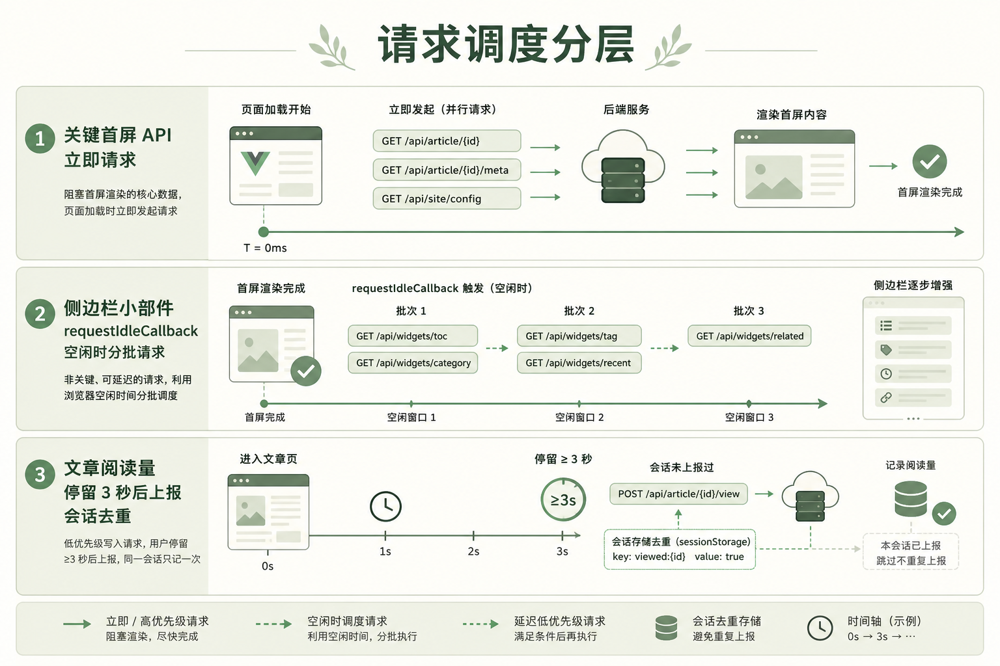

# 博客站的请求别太凶：request 封装 + 错峰调度实战

> 系列第 3 篇
> 关键词：axios、重试、去重、401、requestIdleCallback、浏览量  
> 源码：`src/utils/request.js`、`src/utils/deferRequest.js`、`vue.config.js`

---

## 弱网那天发生了什么

首页一开：轮播、文章流、热门、标签、侧栏广告……七八个请求一起冲。  
超时设置还不短，旧逻辑 GET 默认还能再试两次——于是屏幕上连弹三下「系统接口请求超时」，用户以为站挂了。

其实后端只是慢。  
这篇文章讲我们怎么把「请求层」和「调度层」拆开治。



---

## 一、request.js：统一口径，默认保守

### 1.1 基础约定

```js
const service = axios.create({
  baseURL: process.env.VUE_APP_BASE_API, // 开发 /dev-api → 代理到 API
  timeout: 25000
})
```

- 鉴权头：`Plus-Token`（`headers.isToken === false` 可跳过）  
- 默认防缓存：`Cache-Control` / `Pragma: no-cache`  
- **默认 `retry: 0`**——需要重试的接口在 API 里显式写 `retry: 1`

### 1.2 错误提示去重

```js
function tipError(msg) {
  const now = Date.now()
  if (msg === lastTipMsg && now - lastTipAt < 2500) return
  lastTipMsg = msg
  lastTipAt = now
  Message({ message: msg, type: 'error', duration: 3000 })
}
```

### 1.3 登录失效弹窗单例

并发多个 401 时，只弹一个「重新登录」框：

```js
let isReloginShowing = false
function showReloginConfirm() {
  if (isReloginShowing) return
  isReloginShowing = true
  MessageBox.confirm(...).finally(() => {
    setTimeout(() => { isReloginShowing = false }, 800)
  })
}
```

业务码里一串鉴权相关码（401/403/208/…）都走同一套。

### 1.4 可选重试 + 中间轮次静默

```js
async function request(config) {
  const maxRetry = typeof config.retry === 'number' ? config.retry : 0
  // GET/HEAD + 网络/超时 才允许重试
  // 中间失败 __suppressErrorTip，最终失败再 tipError
  // 退避 sleep(400 * attempt)
}
```

### 1.5 in-flight 去重

同一 method+url+params+data 进行中的请求，复用同一个 Promise，避免组件重复 `created` 打两枪。

```js
if (config.deduplicate !== false && pendingRequests.has(requestKey)) {
  return pendingRequests.get(requestKey)
}
```

不需要 CancelToken 也能挡掉「同刻重复」。

### 1.6 开发代理

```js
// vue.config.js
proxy: {
  [process.env.VUE_APP_BASE_API]: {
    target: 'https://api.xxx.xxx:8443',
    changeOrigin: true,
    pathRewrite: { ['^' + process.env.VUE_APP_BASE_API]: '' }
  }
}
```

---

## 二、deferRequest.js：谁先发，谁后发

请求封装管「怎么发」；调度管「何时发」。

| API | 用途 |
|-----|------|
| `runWhenIdle(fn, timeout)` | 空闲再跑，有 rIC 用 rIC |
| `runAfter(fn, ms)` | 简单延迟 |
| `scheduleArticleViewCount` | 浏览量：会话去重 + 停留 + 隐藏补发 |
| `runWithConcurrency` | 任务池限流 |

### 浏览量为什么要这么麻烦

- 刷新狂点别刷爆计数 → `sessionStorage` 标记 `gp_viewed_{id}`  
- 秒退不算有效阅读 → 默认停留约 3 秒再报  
- 切走标签页可能丢请求 → `visibilitychange` / `pagehide` 补发  

### 首页怎么用

- 轮播、首屏列表：`created` 里立刻请求  
- 侧栏热门 / 次要块：`runWhenIdle` + `runAfter(400/800/1200)` 错开  

文章页侧栏、评论同理。Vertical 布局里热门文章也可以 idle。

---

## 三、实现步骤建议（你改自家项目时）

1. 先把「默认重试」关掉，观察弹错是否立刻安静一半  
2. 给 401 加单例弹窗  
3. 给 tip 加短时间去重  
4. 盘点首屏请求，画出「必须 / 可延后」两列  
5. 延后列改 idle / after  
6. 浏览量单独接 `scheduleArticleViewCount`  

---

## 四、验收（基础）

- [ ] 弱网打开首页，不应连弹三次相同超时  
- [ ] 未登录刷多个需鉴权接口，只弹一次登录框  
- [ ] 同会话重复进同一文章，浏览量接口只走一次（或按你产品规则）  
- [ ] 首屏核心内容先出，侧栏稍后补齐可接受  

---

## 五、把首页请求画成时间线（便于和产品对齐）

假设用户打开 `/`：

```text
0ms     文档解析、Vue 启动
~同刻   permission 预取栏目菜单（第 0 篇）
0+      getCarousel、首屏文章列表（关键）
400ms   侧栏块 A（runAfter）
800ms   侧栏块 B
idle    热门 / 次要推荐（runWhenIdle，timeout 兜底 2s）
```

产品如果问「为啥侧栏慢半拍」，你可以答：故意的，为了首屏先出字。

### API 层怎么声明重试

```js
// 某只读接口确实需要弱网多试一次
export function getSomething() {
  return request({
    url: '/geekplusapp/xxx',
    method: 'get',
    retry: 1
  })
}
```

写操作（POST 下单、留言）**不要**默认重试，除非你做了幂等键。

### 和错误码表的关系

`errorCode.js` 把后端数字码翻成中文。请求层只负责：

- 认不认识这个码  
- 要不要当鉴权失败  
- 要不要 tip  

别在每个页面 `catch` 里再 Message 一遍，否则去重也救不了双提示。约定：**请求层已 `isHandled` 的错误，页面不再弹**。

### 浏览量 schedule 的取消

组件销毁时记得 `cancel()`，避免路由快速切换后，旧文章的计时器还给新页面上报。

```js
mounted() {
  this._viewScheduler = scheduleArticleViewCount({
    articleId: this.id,
    send: () => updateViewCount(this.id)
  })
},
beforeDestroy() {
  this._viewScheduler && this._viewScheduler.cancel()
}
```

---

## 六、切标签 / 切 App 再回来：请求要续上，别轻易「加载失败」

这是和市面成熟站对齐的一块体验：**加载做到一半，人去干别的，回来页面还应尽力自己好起来**，而不是挂着红字让用户手动刷新。

### 6.1 真实场景

| 端 | 用户动作 | 浏览器常见表现 |
|----|----------|----------------|
| 桌面 | 加载中切到别的标签 | `visibilityState === 'hidden'`，定时器/网络被节流，易超时 |
| 手机 | 加载中切到微信/别的 App | 后台标签页被挂起，XHR 可能失败或很慢 |
| 回来 | 再点回本站标签 | 若只把超时当最终失败 → 骨架停住 + Message 报错 |

我们**不会**在 hidden 时主动 `abort` 请求（那样回来一定空）。策略是：

1. 请求照样发（能完成最好）  
2. **失败且发生在后台期间** → 不弹错，进入续传  
3. 听到 `visibilitychange → visible` 或 `online` → **静默再请求**  
4. 仍失败且已回到前台 → 再提示（有 `resumeBudget` 上限）

这和「显式 `retry: 1`」是两本账：`retry` 管弱网多试；`resumeOnVisible` 管**人走了再回来**。

### 6.2 实现位置

| 文件 | 职责 |
|------|------|
| `src/utils/http/pageVisibility.js` | `isPageVisible` / `waitUntilPageVisible`（可移植） |
| `src/utils/http/createRequest.js` | 核心工厂：重试 / 续传 / 去重 / 鉴权（**无 Element 依赖**） |
| `src/utils/http/ui.element.js` | Element Message / MessageBox 适配 |
| `src/utils/request.js` | 本站接线：`getToken`、logout、`errorCode` |
| `src/utils/deferRequest.js` | idle / `runWhenVisible` 调度 |

移植说明见 `src/utils/http/README.md`：复制 `http` 目录 + 改接线文件即可用于其它 Element 项目；非 Element 只换 `ui` 适配器（`showError` + `confirmRelogin`）。

> **归档对照**：拆分前的整文件旧版见 [`docs/archive/request.unsplit.legacy.js`](../../archive/request.unsplit.legacy.js)（标明为未拆分旧有 request，勿直接业务引用）。

### 6.3 核心逻辑（摘录）

```js
let hiddenDuringFlight = !isPageVisible()
const markHidden = () => {
  if (document.visibilityState === 'hidden') hiddenDuringFlight = true
}
document.addEventListener('visibilitychange', markHidden)

try {
  if (resumeOnVisible && !isPageVisible()) {
    await waitUntilPageVisible()
  }
  return await service({ ...config, __suppressErrorTip: /* 续传预算未用尽时先压制 */ })
} catch (err) {
  if (
    resumeOnVisible &&
    resumeUsed < resumeBudget &&
    isRetriableError(err) &&
    (hiddenDuringFlight || !isPageVisible())
  ) {
    resumeUsed++
    await waitUntilPageVisible()
    await sleep(280 + resumeUsed * 120)
    continue
  }
  // 最终失败再 tipError（tipError 在 hidden 时也会直接 return）
}
```

写操作默认**关闭**续传，避免留言被静默打两次。关闭某只读接口的续传：

```js
request({ url: '...', method: 'get', resumeOnVisible: false })
```

### 6.4 和调度层怎么配合

- 侧栏 `runWhenIdle`：人在后台时**不抢着发**，回前台再 idle  
- 业务若要「一回前台就补拉」：`runWhenVisible(() => this.fetchList())`  
- 浏览量：仍可在 `hidden` 时补发一次（统计尽量不丢），与列表续传目标不同  

### 6.5 验收建议

1. Chrome：开首页，Network 限速 Slow 3G，加载中立刻切到别的标签 20 秒再切回——应继续出内容或短暂后续上，而不是一排超时 Toast。  
2. 手机：同样操作切到桌面再回来。  
3. 留言提交中切走——不应自动再 POST 一次。  

### 6.6 和产品说人话

> 我们不保证后台挂起时浏览器一定把包跑完，但保证：**你回到页面后，读接口会自己再试，尽量不让你看到一次「加载失败」就卡死。**

---

## 七、验收（总表）

- [ ] 弱网打开首页，不应连弹三次相同超时  
- [ ] 未登录刷多个需鉴权接口，只弹一次登录框  
- [ ] 同会话重复进同一文章，浏览量按会话去重  
- [ ] 首屏关键先出，侧栏可稍后  
- [ ] **加载中切走再回来，GET 能续上，不无故弹失败**  
- [ ] **写操作不会因续传被静默重放**

---

## 八、小结

> 默认别折腾用户；关键路径先活；统计别灌水；**人走了再回来，读请求要懂得续上。**

和第 0 篇的菜单预取是好朋友：预取也是「早发但可缓存」，不是「一股脑全发」。

---

**系列导航**  
[← 菜单溢出](./02-横屏菜单溢出折叠到更多.md) ｜ [下一篇：分享卡片 →](./04-Canvas文章分享卡片.md)
