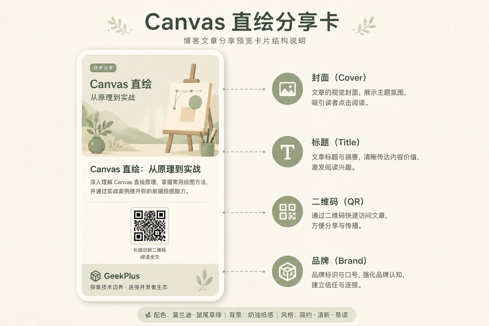

# 不做 DOM 截图：用 Canvas 给博客文章画一张能长按保存的分享卡

> 系列第 4 篇
> 关键词：Canvas、dataURL、CORS、Web Share、qrcode  
> 源码：`src/views/article/mobile.vue`（路由 `/article/:id`）

---

## 我们到底要解决什么问题

用户看完一篇文章，想发朋友圈 / 丢到群里。  
理想体验是：点「分享」→ 看到一张**带封面、标题、摘要、站点二维码**的卡片 → 长按保存或系统分享。

两条常见岔路我们都试过或不想试：

| 方案 | 为啥不主用 |
|------|------------|
| 只靠 Open Graph | 适合爬虫预览链接，不给用户一张「可保存的图」 |
| html2canvas 截 DOM | 样式一复杂就糊；跨域图污染 canvas；调试成本高 |

所以主路径改成：**离屏 Canvas 按固定版式直绘 → 导出 JPEG**。



---

## 一、整体流程（实现步骤）

### 步骤 1：打开面板

`toggleShareWith`：打开 / 关闭；用 `shareGenToken` 防止连点竞态。

### 步骤 2：并行准备素材

```js
const [coverImg, logoImg, qrData] = await Promise.all([
  this.loadShareCoverImage(remoteCover, localCover),
  this.loadImageEl(logoSrc, 400, { crossOrigin: null }),
  new Promise((resolve) => {
    QRCode.toDataURL(this.windowUrl, { /* ... */ }, (err, res) => {
      resolve(err ? '' : res)
    })
  })
])
```

### 步骤 3：画到 canvas

固定视觉宽 360 CSS 像素，`dpr = 2`，导出 `image/jpeg` 质量约 0.88——清晰度和体积折中。

版式自上而下：

1. 白底卡片  
2. 圆角封面（cover fit）  
3. 标题最多两行  
4. 摘要最多三行  
5. Logo + 品牌名 + 二维码  
6. 底部小字链接  

### 步骤 4：按端分发

- **桌面**：可转 blob 触发 download  
- **触控**：预览**坚持 dataURL**；可走 Web Share API（有则）

---

## 二、绘制核心摘录

```js
drawShareCardToDataUrl({ coverImg, logoImg, qrImg, title, summary, link, brand }) {
  const cssW = 360
  const dpr = 2
  const canvas = document.createElement('canvas')
  canvas.width = Math.round(cssW * dpr)
  canvas.height = Math.round(cssH * dpr)
  const ctx = canvas.getContext('2d')
  ctx.scale(dpr, dpr)

  ctx.fillStyle = '#ffffff'
  ctx.fillRect(0, 0, cssW, cssH)

  // 圆角裁切封面
  this.roundRect(ctx, pad, pad, cssW - pad * 2, coverH, 8)
  ctx.save()
  ctx.clip()
  this.drawCoverFit(ctx, coverImg, pad, pad, cssW - pad * 2, coverH)
  ctx.restore()

  // wrapText 画标题 / 摘要……
  // drawImage logo & qr……

  return canvas.toDataURL('image/jpeg', 0.88)
}
```

`wrapText`、`drawCoverFit`、`roundRect` 都是自家小工具函数，完整实现见 `mobile.vue`。

---

## 三、踩坑笔记（建议收藏）

### 1. CORS 污染

跨域封面直接 `new Image()` 画进 canvas，`toDataURL` 会 SecurityError。

**对策：** `fetch` 封面 → blob → objectURL → 再画；并做 `canUseImageInCanvas` 探测。多候选 URL（远端、本地默认）逐个试。

### 2. 200 OK 但是空文件

有的图床/反代会返回空 body。画之前看 `blob.size`。

### 3. iOS WebKit 长按预览「假死」

分享或 `a[download]` 走 `blob:` 之后，同页再长按预览可能失效。

**对策：** 触控端预览绑定 **dataURL**（`shareCardImg`），不要依赖 blob URL 当唯一预览源。

### 4. 竞态

快速开关面板会触发多次生成。用递增 token，过期结果丢弃，避免旧图盖新图。

### 5. 缓存

同一篇文章同一封面可按 `shareCardCacheKey` 跳过重复绘制。

---

## 四、和其它文章页的关系

- `/article/:id` → `mobile.vue`：**完整分享卡**（主路径）  
- `/article2` → `primary.vue`：历史实现，未完全对齐  
- `/article1` → 简单分享对话框  

对外只主推一条路径，避免三套行为不一致。

---

## 五、验收

- [ ] 有封面 / 无封面都能出卡（无封面灰底占位）  
- [ ] 标题很长会折行而不是溢出画布  
- [ ] 手机可长按保存预览图  
- [ ] 二维码扫开是当前文章 URL  

线上部署后打开任意文章试一下

---

## 六、小结

分享卡本质是「设计稿程序化」。  
Canvas 直绘换来的是可控的像素和可控的坑；坑主要在跨域和 WebKit，不在 canvas API 本身。

---


---

## 七、版式参数怎么调才像「设计过」

直绘最怕「程序员排版」：字顶着边、行距漂、二维码糊成马赛克。

可调参数建议集中成常量，方便运营/设计改一版：

```js
const SHARE = {
  cssW: 360,
  dpr: 2,
  pad: 14,
  coverH: 170,
  titleSize: 16,
  titleLines: 2,
  summarySize: 12,
  summaryLines: 3,
  qrSize: 64,
  jpegQuality: 0.88
}
```

封面用「cover」而不是「拉伸」：短边填满，长边裁切，避免人像变形。  
二维码周围留白，别和品牌字贴太近——微信扫描容错靠的就是静区。

### 生成中的 UI

- `shareCardGenerating` 时按钮 disabled，预览区放骨架或转圈  
- 失败时给「重试」而不是空白  
- 成功后桌面提供「下载图片」，触控提示「长按图片保存」  

### 要不要服务端出图

流量大、版式统一时，可以让后端用 Puppeteer/Skia 出图，CDN 缓存。  
个人博客体量下，前端 Canvas 足够，还省一台出图服务。等哪天要批量海报再升级。


**系列导航**  
[← request 网络](./03-request与网络请求调度.md) ｜ [下一篇：PlusCarousel →](./05-PlusCarousel自研轮播.md)
